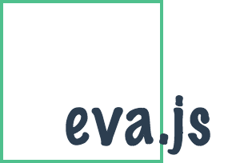

<p align="center">
  <br>
  <br><strong>eva.js</strong> is a complete solution to <br>building modern webs with Vue.js.
</p>

<p align="center">
  <a href="https://npmjs.com/package/eva.js"></a>
  <a href="https://npmjs.com/package/eva.js"></a>
  <a href="https://circleci.com/gh/egoist/eva.js/tree/master"></a>
  <a href="https://david-dm.org/egoist/eva.js">
    
  </a>
</p>

## tl;dr

```js
// model
app.model()
// router
app.router()
// bootstrap
app.start()
```

Play with the [JSBin example](http://jsbin.com/laqopo/edit?js,output) or the [simple webpack example](https://github.com/egoist/eva-webpack-simple) 😀

<details><summary>Table of Contents</summary>

<!-- toc -->

- [Sites using eva.js](#sites-using-evajs)
- [Features](#features)
- [Install](#install)
- [Usage](#usage)
- [Concepts](#concepts)
  * [Models](#models)
    + [Top-level model:](#top-level-model)
    + [Namespaced model:](#namespaced-model)
    + [Helpers:](#helpers)
  * [Router](#router)
  * [View](#view)
- [API](#api)
  * [new EVA([options: object])](#new-evaoptions-object)
    + [options.mode](#optionsmode)
  * [app.model(model: object)](#appmodelmodel-object)
  * [app.router(handler: function)](#approuterhandler-function)
  * [app.use(plugin: function, [options: object])](#appuseplugin-function-options-object)
  * [app.start(instance: object, selector: string)](#appstartinstance-object-selector-string)
  * [app.$store](#appstore)
  * [app.$router](#approuter)
- [License](#license)

<!-- tocstop -->

</details>

## Sites using eva.js

Feel free to add your project here!

- [vbuild.js.org](https://vbuild.js.org/) ([source](https://github.com/egoist/vbuild.js.org))

## Features

- Battery included, Vue 2 and its friends (Vuex & Vue-Router)
- Inspired by the [choo](https://github.com/yoshuawuyts/choo) framework which is inpired by the [elm architecture](https://guide.elm-lang.org/architecture/)

## Install

```bash
$ npm install --save eva.js
```

In case you may want to use it directly in browser instead, view https://unpkg.com/eva.js/dist/, and add:

```html
<!-- global variable `EVA` is available as a constructor(class) -->
<script src="/path/to/eva.js"></script>
```

## Usage

```js
import EVA from 'eva.js'

// Create app instance
const app = new EVA()

// A counter model
app.model({
  state: {count: 0},
  mutations: {
    INCREMENT(state) {state.count++}
  }
})

// A home view
const Home = {
  computed: {
    count() {
      return this.$store.state.count
    }
  },
  render(h) {
    return h(
      'div',
      [
        h('h1', 'Home'),
        h('button', {
          on: {click: () => this.$store.commit('INCREMENT')}
        }, this.count)
      ]
    )
  }
}

// Apply views to relevant routes
// route(path, view, child_routes)
app.router(route => [
  route('/', Home)
])

// Start app
const App = {
  render(h) {
    return (
      h(
        'div',
        {attrs: {id: 'app'}},
        [
          h('router-view')
        ]
      ),
    )
  }
}
app.start(App, '#app')
```

## Concepts

### Models

A model contains it's initial state and the methods you use to update its state, in fact, it's a typical Vuex module too.

#### Top-level model:

```js
// An app instance only have at most one top-level model
app.model({
  state: {count: 0},
  mutations: {
    INCREMENT(state) {state.count++}
  }
})
```

#### Namespaced model:

```js
// An app could have multiple namespaced models
app.model({
  name: 'user',
  state: {login: false},
  mutations: {
    LOG_IN(state) {state.login = true}
  }
})
```

> In most cases using namespaces is beneficial, as having clear boundaries makes it easier to follow logic.

#### Helpers:

As how you use Vuex^2, you can use its helpers too:

```js
const {mapState, mapActions, mapGetters} = require('eva.js')
// or ES6 modules
import {mapState, mapActions, mapGetters} from 'eva.js'
```

### Router

The router could render the component which matches the URL path. It has a `route` helper for creating an actual route object used in `vue-router`. routes are passed in as a nested array.

```js
app.router(route => [
  route('/', Home),
  route('/settings', Settings, [
    route('/profile', SettingsProfile),
    route('/password', SettingsPassword)
  ])
])
```

### View

A view is a simple Vue component, that easy :)

## API

### new EVA([options: object])

Create an app instance.

#### options.mode

The router mode, can be either `hash` *(default)* or `history`.

### app.model(model: object)

Register a model, a.k.a. store module in Vuex. You can omit the `name` property to make it top-level.

### app.router(handler: function)

Register routes.

### app.use(plugin: function, [options: object])

The same as `Vue.use`, you can apply any Vue plugin.

### app.start(instance: object, selector: string)

Mount app to a domNode by given selector.

### app.$store

The vuex store instance.

### app.$router

The vue-router instance.

## License

MIT &copy; [EGOIST](https://github.com/egoist)
